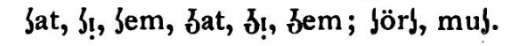

# Chapter d.

## Injury of Unsystematic Spelling

English *orthography* is so bad, so impracticable, that I shall only spend a few words oon this subject for the purpose of filling out the argument. The only true mode of spelling words and the system easiest to learn by children of all nationalities and stations is to have "*one letter for one sound, and only one sound for one letter*." Now we begin by telling the child that this short round-like character is called "a" as "a" in *ale*. The child follows and says "a." He has now learned the name of that character. But he is soon bewildered; the same letter without any modification is differently pronounced in 1 *ale*, 2 *at*, 3 *arm* and 4 *all*. Then there are hosts of other combinations that stand for the first sound, other arbitrary combinations that stand for the second, third, fourth or fifth sound. Again the same letter or combination of letters stand at one time for one, and at another time for another sound. There are many letters for one sound, and many sounds for one letter. There is no guiding rule. Mental energy is wasted. Each word becomes a special act of memory, like the Chinese characters. It makes it difficult to learn to read and write. Those who are poor and have but little time to go to school are scared away or cannot master it; hence such spelling must increase ignorance. The wealthier classes who can afford to send their children to school long enough to learn this *orthography*, wastes so much time in doing so that they cannot learn as much of arithmetic, geography, grammar, history, laws of health, civil government, and music. All must be content with less knowledge and less accomplishments by reason of the irregular spelling. In Germany and Skandinavia no spelling-book is used. There is no need of one, because they spell according to sound. After the letters are learned in their primers, they spell a few words from their reading lessons and copy the reading lessons upon the slates, and as the same letter always has the same sound, children soon get the hang of spelling without waste of time. Spain, Germany and Skandinavia improved their spelling long ago. In American common schools the principal object is to learn to spell. There is no useful knowledge in this early and late spelling, and spelling and spelling. It is as time-wasting and impracticable as the Chinese sign-writing. In both cases does every word necessitate a special act of memory. Both are hindrances to education. Both are degrading. The English are fortunately waking up to see this injury. Ex-Premier Gladstone, the "Society of Arts," the "Association of Elementary Teachers," many ministers and editors in England are in favor of phonetic spelling. In the United States and Canada there are a number of journals advocating the system. We have many Professors in Universities and Colleges in its favor, among which I can name such learned scholars as Prof. Francis A. March, of Lafayette College, author of Anglo-Saxon Grammar and Reader; Prof. W.D. Whitney, of Yale College, author of "Language and the Study of Language;" Prof. T.R. Lounsbury, of Yale College. Ben Pitman and the Longley brothers have done much good for the cause by their monthly journals and boooks. Prof. Boyd estimated about 30 years ago that it required English children three years longer to learn to read and write than it did for the children of Germany, Skandinavia and Holland. Major Chas. Sotry, of Chicago, estimates the time wasted to equal from 5 to 7 years, but I have preferred to take the shortest time, three years. It is again estimated by Prof. Boyd and others that it costs the American people $10 extra every year on account of unsystematic spelling. Having about 10 million school-children, and an extra cost of $10 for each child amounts to a loss of 100 million dollars every year for this defect alone! 

*(digitizer's note: adjusting for 2021, there are ~50 million in public school. $10 would be ~$279 adjusting for inflation. This is a loss of ~$14 billion every year.)*

I said on the title page that the present English was a national misfortune. Let me ask, is it not a national misfortune for the country to lose 100 millions annually and have every person robbed of three years of his or her life on account of spelling? And yet our arbitrary borrowing is of greater damage still, which I shall endeavoor to prove in the next chapter. The loss of time and, what is worse, the loss of useful life-guiding knowledge, occasioned by taking expressions of less frequent ideas from strange tongues not explained by well-known common words as in Greek, German and Irish will probably amount to much more than another 100 millions. But more on this point in the next chapter. The only ones who can learn English spelling are type-setters. No others can learn it. At a school examination in Houston County, Minnesota, in 1876, only two teachers out of 48 could spell correctly the 20 words give as tests. At the University of Wisconsin at Madison, the senior class, the graduating class in January A.D. 1874, handed their Professor of English written essays as required, but only one high-class student of the whole number had spelled each word in his composition correctly, though all had chosen their own subjects and their own words. Having taught English school more than 10 years, I have bene present at a great number of examinations, and I undertake to say that English spelling cannot be learned by the people. Only type-setters and occasionally an old-fashioned school-teacher, who values orthography above all other knowledge, can spell.

Sir Walter Scott spelt 5 words wrongly in a receipt given for money received as initiation fee to a certain society (spelt by him sosciety) Scott's manuscripts had always to be corrected by the printers. Shakespear has at different times spelt his own name in 128 different ways. Spelling does not show the derivation of words except occasionally. There is no "s," and no "g," and no "l" in the old words for *island*, *sovereign* and *could*. Comparative philology is now such that the relationship of words can be traced and proven though the words compared have not a letter in common and differ in meaning as much as black and white. The proper function of spelling is to give a true picture of the spoken language, so that he who *sees* a word may know how it is *pronounced*, and he who *hears* a word may know how it is *written*. 

But even supposing spelling did show derivation of words, which it does not, except in part, it will hardly be demanded by an education-loving people that 999 men should be burdened every day throughout life by signs of derivation which are unreliable and always insufficient, and for which they care nothing, simply that one man out of a thousand may occasionally find it easier to trace some curious word to its ancient source! Max Muller and W.D. Whitney, comparative philologists, say it would have been better for linguists if each age had given them a true picture of their spoken words. Language is above all for the good of the people at large. Dr. Beaty says, we waste enough time in our schools on spelling to give our children a good literary and scientific education. Shall we keep up a mode of spelling, which professional teachers, university students of senior classes and famous authors cannot master? Do you want your children to waste their time on this unscientific and impracticable spelling, or do you want them to acquire useful knowledge? Americanism is to select what is best from other countries and adopt it here. This is a composite nation, a daughter of the whole western and central Europe. This nation is not a daughter of England. The spelling is merely English, but not American in principle. Anything to be American must be eclectic and practical. (See chapter on "Americanism.") In German there are occassionally a silent "h" for the purpose of lengthening or shortening the sound, as *Jahr* (year) and *Lamm* (lamb). Such spelling, however, is not misleading, for it cannot be pronounced differently on account of these extra letters. Their spelling is remarkably systematic and uniform. Even the Germans, who have already done so much for systematic spelling, are discussing the idea of making it still more phonetic. How much more ought not spelling to be discussed among us!

> Igh cee a phat chat awn thea chere. Eigh knoh knot whaht thie chait wawnts tu eet.

(Spelt according to analogy.)

The above is about as strange as the following: 

Prof. Whitney calls our spelling a millstone on the necks of the people.

The Old Natives boast of being practical. Is this *orthography* practical, or will they help make it so? As all classes are injured by this spelling, all should as best they can in their circle assist to create a public opinion. The best way to do that is to support journals and writers who devote their time to this noble cause wherever they may be found. As Germans and Skandinavians are great linguists, they must keep up their credit for intelligence by taking the side of language improvement, otherwise they will have no influence. It will be said by other Americans: "They can criticize, but they cannot help reform."

Why could not German, Irish and Skandinavian editors procure $1 or $2 worth of phonetic type and insert a few paragraphs of the Amerikan language in their journals? They may receive no pay for this, but if no one will aid the poor and helpless children, what becomes of patriotism? The Old Natives cannot influence this vast and heterogeneous population alone, even if they were united, which they are not. If we do not all help, we may never see a good language for our grand country. Language reform is as much our business as that of any one else. We have men in all stations of life and in all professions, from the common school teacher to the legislator, editor and university professor, and our men are marching to the front every year. We shall all soon become Americans. No matter how much we may study English, let us not forget the German, Irish and Skandinavian mother tongues. The Jews have clung to their Hebrew language. They say their prayers and chant their joys and sorrows in their ancient tongue, and yet they are the world's greatest business men, as well as the most famous in literature. They are also the least criminal part of our population. They have the greatest regard for old parents and young children, and have the least divorces. Fidelity in one respect produces fidelity in another.
